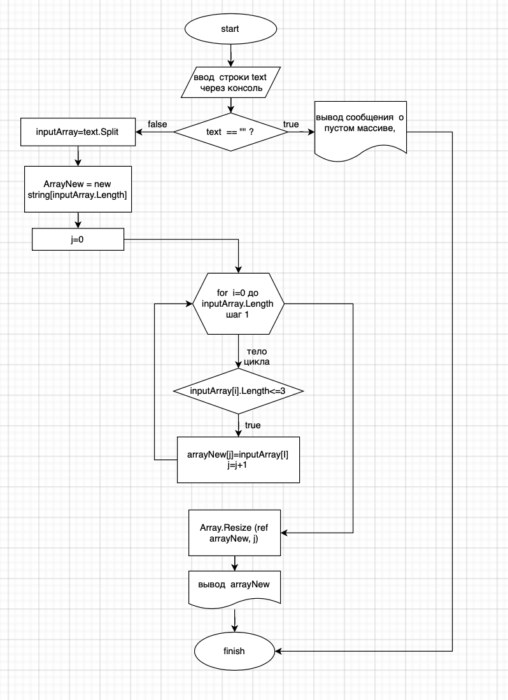

# Описание решения
1. Вводим элементы массива через пробел как единую строку
2. Если пользователь ничего не вводил, выводим сообщение, что массив пустой и выходим из программы
3. Единую строку делим на отдельные элементы при помощи метода Split и формируем из этих элементов массив inputArray
4. Создаем новый массив arrayNew такой же длины как inputArray
5. создаем новый элемент j и присваиваем ему нулевое значение, он будет хранить в себе количество элементов нового массива
6. Запускаем цикл for от i=0 до конца длины inputArray c шагом 1
7. В теле цикла проверяем каждый элемент массива inputArray[i], если длина элемента меньше 3, то 
* j-тому элементу массива arrayNew присваиваем данный элемент
* j присваиваем j+1
8. После выхода из цикла, уменьшаем длину массива arrayNew до j элементов с помощью метода Resize
9. Выводим на экран новый массив arrayNew
10. Завершаем программу

Блок схема ниже:
